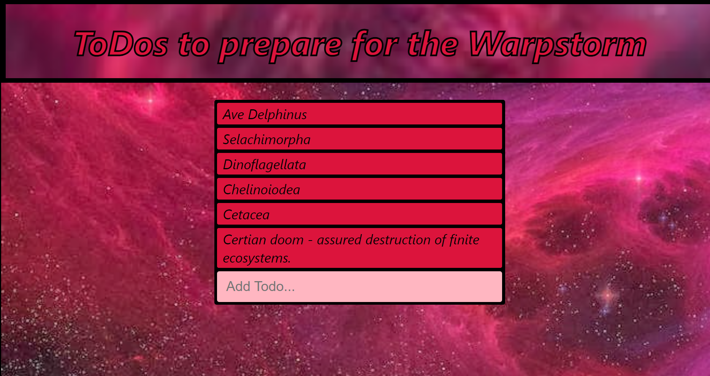

Project status - COMPLETE

------------------------------------------------------------

Todos to prepare for the warpstorm

"Todos to prepare for the warpstorm" is a app demo that utilizes Refractoring form components. Essentially, the application refractors data making the application more efficient and allows for resuble form components that boost devoloper productivity. 

Using reusable input components allows for cleaner and more maintainable code. 

------------------------------------------------------------

